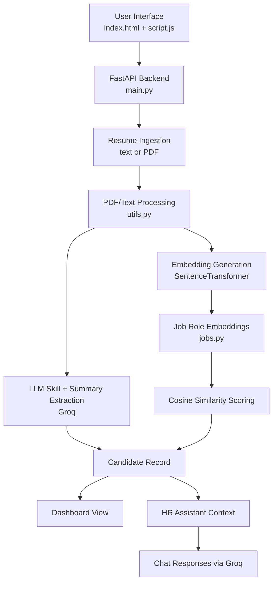

# HR-LLM Pro: AI Resume Screener

## Overview

HR-LLM Pro is an AI-powered resume screening system that helps HR teams quickly evaluate candidates.
It analyzes resume content, extracts skills and summary insights, matches candidates against predefined job roles using semantic similarity, and enables natural language querying through an HR assistant chat.

## Why I Built This Project

Recruiters often spend too much time manually scanning resumes, and keyword-only filters frequently miss strong candidates.
I built this project to demonstrate how LLMs and embeddings can reduce screening time while improving match quality and decision support.

## Problem Statement

Manual resume evaluation has three key challenges:
1. It is time-consuming and hard to scale.
2. Keyword matching can be shallow and inaccurate.
3. Comparing multiple candidates consistently is difficult.

The goal of this project is to automate first-pass screening while still producing human-readable reasoning.

## Design / Architecture

The system uses a simple full-stack architecture:
1. Frontend collects candidate details and resume input.
2. FastAPI backend processes input and coordinates AI steps.
3. Utility layer handles PDF parsing, embeddings, and LLM calls.
4. Matching module compares candidate vectors to role vectors.
5. Results are shown on dashboard and reused by chat assistant.

## Workflow

1. User enters candidate name and uploads a resume or pastes text.
2. Backend extracts resume content from PDF/TXT input.
3. LLM extracts key skills and creates a short professional summary.
4. Embedding model converts resume and job descriptions into vectors.
5. Cosine similarity ranks best-fit job roles.
6. Candidate profile is stored in memory and shown on dashboard.
7. HR user can ask follow-up questions in chat based on stored candidate context.

## Features

- Resume input via PDF upload, text file upload, or direct pasted text
- AI-based skill extraction and summary generation
- Semantic job matching using embeddings + cosine similarity
- Candidate dashboard with top role score and summary cards
- HR assistant chat for candidate-centric Q and A
- Quick reset endpoint to clear candidate data
- Maximum candidate cap for focused demo evaluation

## Challenges Faced

- Parsing resume data reliably across different file formats
- Avoiding weak keyword-only matching logic
- Keeping AI calls responsive while maintaining useful output quality
- Structuring data so both dashboard and chatbot can use the same source of truth
- Managing local development simplicity with multiple AI components

## How I Solved Them

- Added dedicated PDF text extraction with fallback handling
- Implemented embedding-based similarity instead of pure keyword matching
- Kept architecture modular by isolating AI utilities in a separate module
- Stored normalized candidate objects with reusable fields for UI and chat
- Limited candidate volume for predictable demo performance and clarity

## Outcome

The final system provides a practical screening assistant that can:
- Reduce manual screening effort
- Surface better-fit roles through semantic comparison
- Produce concise candidate summaries for quicker review
- Support interactive HR Q and A over uploaded resume data

This project demonstrates an end-to-end AI workflow that is lightweight, explainable, and suitable for extension into production-grade recruitment tooling.

## Tech Stack

- Python
- FastAPI
- Uvicorn
- Groq API (LLM)
- sentence-transformers (all-MiniLM-L6-v2)
- NumPy
- PyPDF
- HTML
- TailwindCSS
- Vanilla JavaScript

## Future Improvements

- Move candidate storage from memory to database persistence
- Add authentication and role-based access control
- Allow dynamic job role creation and editing from UI
- Improve parsing for complex resume layouts
- Add evaluation metrics and explainability details for match scoring
- Add automated unit and integration tests
- Externalize API keys fully via environment configuration
